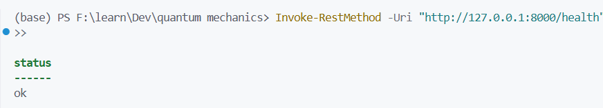
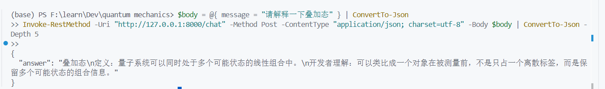
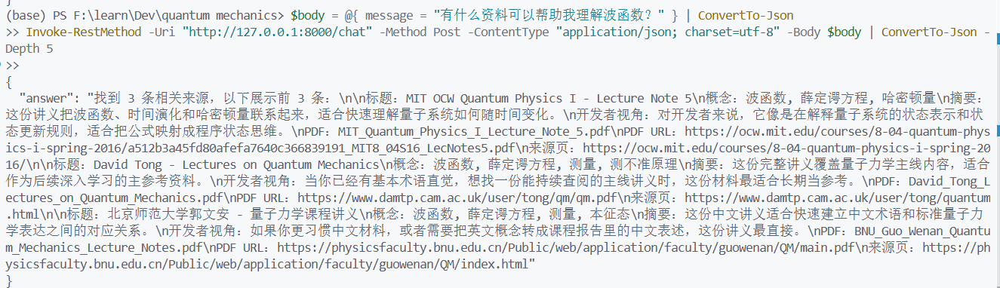
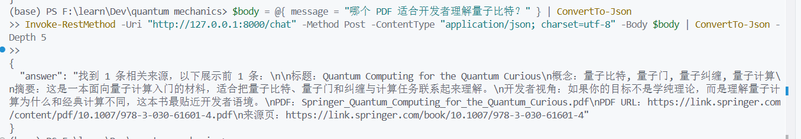
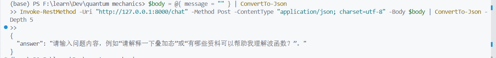
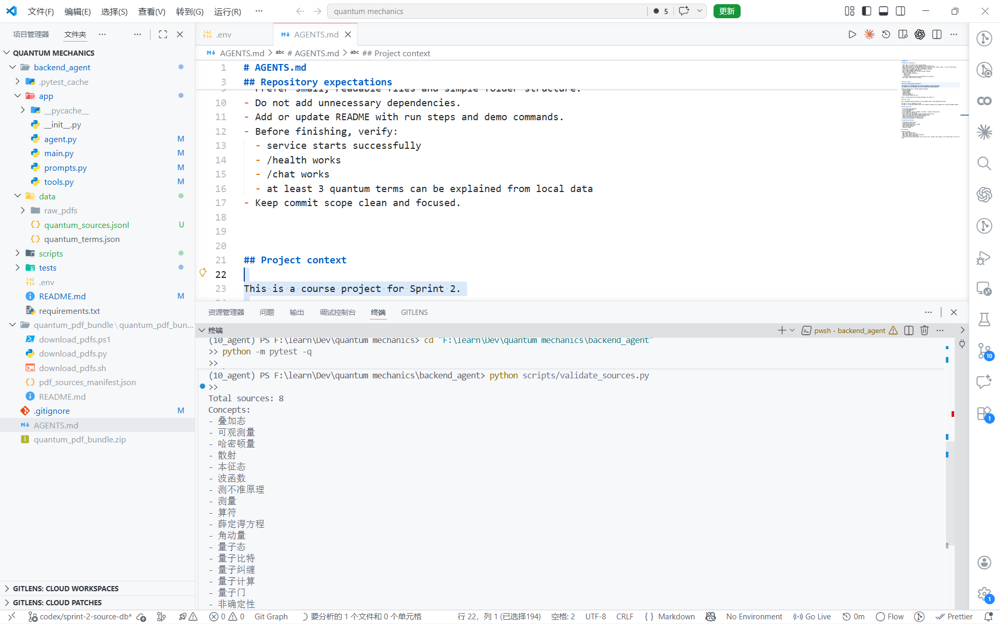

# Quantum Mechanics Backend Agent

面向开发者的量子力学学习助手后端项目。

本项目是课程作业中的后端部分，目标是为“没有量子力学背景的开发者”提供一个可运行、可演示、可扩展的量子力学学习助手。当前版本基于 Sprint 1 和 Sprint 2 的实现，已经具备术语解释、来源资料检索、基础问答和接口演示能力。

## 项目目标

- 为开发者提供量子力学基础概念解释
- 为开发者提供可继续阅读的课程讲义、PDF 资料和参考来源
- 提供一个最小可运行的后端 Agent 原型，便于课程演示和后续迭代

## 当前能力

- `GET /health`：健康检查
- `POST /chat`：统一问答接口
- 本地量子术语查询：
  - 例如 `波函数`、`叠加态`、`测不准原理`
- 本地来源资料检索：
  - 根据概念返回相关 PDF、讲义、来源页和简短摘要
- 通用问题通过 LangChain + Kimi API 回答
- 来源库校验脚本：
  - `scripts/validate_sources.py`

## 技术栈

- Python
- FastAPI
- LangChain
- langchain-openai
- Kimi API（OpenAI-compatible endpoint）

## 项目结构

```text
quantum mechanics/
├─ backend_agent/
│  ├─ app/
│  │  ├─ main.py
│  │  ├─ agent.py
│  │  ├─ tools.py
│  │  └─ prompts.py
│  ├─ data/
│  │  ├─ quantum_terms.json
│  │  ├─ quantum_sources.jsonl
│  │  └─ raw_pdfs/                  # 本地 PDF 资料，仅本地使用，不提交
│  ├─ scripts/
│  │  └─ validate_sources.py
│  ├─ tests/
│  ├─ requirements.txt
│  ├─ .env
│  └─ README.md
├─ figs/
│  ├─ 状态码ok.png
│  ├─ 解释概念.png
│  ├─ 查找相关资料.png
│  ├─ 检索概念相关的资料.png
│  ├─ 空输入处理.png
│  └─ 验证概念.png
└─ README.md
```

## 环境要求

- Python 3.10 及以上
- 可访问 Kimi API 的网络环境
- 一个有效的 `MOONSHOT_API_KEY`

## 安装依赖

在项目根目录执行：

```powershell
cd "F:\learn\Dev\quantum mechanics\backend_agent"
python -m pip install -r requirements.txt
```

## 配置环境变量

在 `backend_agent/.env` 中写入：

```env
MOONSHOT_API_KEY=你的实际Kimi_API_Key
```

说明：

- 不要把真实 `.env` 提交到 Git
- 如果没有配置 `MOONSHOT_API_KEY`，通用模型问答会失败
- 本地术语查询和本地来源检索不依赖联网模型

## 启动服务

在 `backend_agent` 目录执行：

```powershell
python -m uvicorn app.main:app --reload
```

启动后可访问：

- Swagger 文档：`http://127.0.0.1:8000/docs`
- 健康检查：`http://127.0.0.1:8000/health`

## 接口说明

### `GET /health`

请求：

```http
GET /health
```

返回：

```json
{"status": "ok"}
```

### `POST /chat`

请求体：

```json
{"message": "请解释一下叠加态"}
```

返回体：

```json
{"answer": "......"}
```

当前版本对外统一保持简单格式，只返回一个 `answer` 字段。

## 本地检查命令

### 1. 运行测试

```powershell
cd "F:\learn\Dev\quantum mechanics\backend_agent"
python -m pytest -q
```

### 2. 校验来源库

```powershell
python scripts/validate_sources.py
```

该脚本会：

- 读取 `data/quantum_sources.jsonl`
- 检查每一行是否为合法 JSON
- 输出来源总数
- 输出概念标签列表

## 接口测试命令

### 健康检查

```powershell
Invoke-RestMethod -Uri "http://127.0.0.1:8000/health"
```

### 术语解释

```powershell
$body = @{ message = "请解释一下叠加态" } | ConvertTo-Json
Invoke-RestMethod -Uri "http://127.0.0.1:8000/chat" -Method Post -ContentType "application/json; charset=utf-8" -Body $body | ConvertTo-Json -Depth 5
```

### 来源资料查询

```powershell
$body = @{ message = "有什么资料可以帮助我理解波函数？" } | ConvertTo-Json
Invoke-RestMethod -Uri "http://127.0.0.1:8000/chat" -Method Post -ContentType "application/json; charset=utf-8" -Body $body | ConvertTo-Json -Depth 5
```

### 量子比特资料推荐

```powershell
$body = @{ message = "哪个 PDF 适合开发者理解量子比特？" } | ConvertTo-Json
Invoke-RestMethod -Uri "http://127.0.0.1:8000/chat" -Method Post -ContentType "application/json; charset=utf-8" -Body $body | ConvertTo-Json -Depth 5
```

### 空输入处理

```powershell
$body = @{ message = "" } | ConvertTo-Json
Invoke-RestMethod -Uri "http://127.0.0.1:8000/chat" -Method Post -ContentType "application/json; charset=utf-8" -Body $body | ConvertTo-Json -Depth 5
```

### 通用模型问答

```powershell
$body = @{ message = "请用一句话解释量子力学和经典力学的区别" } | ConvertTo-Json
Invoke-RestMethod -Uri "http://127.0.0.1:8000/chat" -Method Post -ContentType "application/json; charset=utf-8" -Body $body | ConvertTo-Json -Depth 5
```

## 演示建议顺序

推荐按下面顺序进行课程演示：

1. 启动后端服务
2. 打开 Swagger 页面确认接口存在
3. 演示 `/health`
4. 演示基础术语解释
5. 演示来源资料检索
6. 演示量子比特资料推荐
7. 演示空输入容错
8. 演示来源校验脚本

## 演示截图

### 健康检查



### 术语解释



### 来源资料查询



### 概念资料检索



### 空输入处理



### 来源库校验



## 数据说明

### 1. 本地术语库

文件：

```text
backend_agent/data/quantum_terms.json
```

用途：

- 存放基础量子力学术语定义
- 用于快速解释概念

### 2. 轻量来源库

文件：

```text
backend_agent/data/quantum_sources.jsonl
```

用途：

- 存放 PDF 来源元数据
- 支持基于概念的来源查询
- 每条记录包含标题、作者/机构、PDF 文件名、来源页、概念、摘要和开发者视角说明

### 3. 原始 PDF

目录：

```text
backend_agent/data/raw_pdfs/
```

说明：

- 原始 PDF 仅作为本地参考资料
- 不应提交到 Git
- 仓库中只保存元数据和自写摘要，不保存大量原文内容

## 注意事项

- 如果 Kimi API 临时拥堵，通用问答可能返回错误信息，但本地术语和来源检索仍可工作
- 如果 `quantum_sources.jsonl` 缺失或格式错误，来源检索会返回友好提示，不会导致服务崩溃
- 如果 `message` 为空，接口会返回明确提示，不会报错

## 当前实现覆盖范围

已完成：

- Sprint 1 最小后端原型
- Sprint 2 轻量来源资料库
- 本地术语解释
- 本地来源检索
- 基础 API 健康检查
- 基本错误处理
- README、截图和演示说明

未做内容：

- 向量数据库
- Embeddings
- 全量 PDF 运行时解析
- RAG
- Docker
- 前端界面
- 数据库持久化


